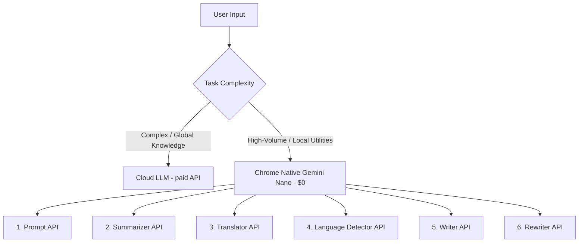

# The Decentralization of Inference: Scaling Web Applications with Chrome's On-Device AI

As generative AI transitions from a novel capability to a core infrastructure layer, engineering teams face a critical challenge: **the soaring marginal cost of LLM inference.** 

When every search query, spellcheck, or content summarization triggers a call to a centralized API (such as OpenAI's GPT-4o or Google's Gemini Pro), scaling to millions of active users introduces massive operational overhead. In addition, latency penalties, network dependency, and data privacy regulations pose significant engineering bottlenecks.

The solution lies in a hybrid architecture that splits workloads between the cloud and the client. With Google Chrome's native integration of **Gemini Nano** via the WebGPU API, web browsers can now run local inference directly on the user's hardware.

This article explores the strategic, architectural, and resource implications of built-in browser LLMs, referencing the interactive demonstrations and playgrounds hosted at [sarvesh.website/chrome-ai](https://sarvesh.website/chrome-ai).

---

## 1. Cloud-First vs. Client-Side: A Strategic Comparison

For complex reasoning, multi-turn tool calling, or vast knowledge retrieval, centralized frontier models (Online LLMs) remain indispensable. However, the vast majority of web interactions consist of smaller, high-frequency utility tasks—such as language detection, text summarization, content rewriting, and simple query routing. 

Using a cloud-hosted LLM for these micro-tasks is highly inefficient. Below is a strategic breakdown of how client-side models compare with cloud-based options:

| Metric / Dimension | Cloud/Online LLMs (e.g., Gemini Pro) | Browser/Offline LLMs (Gemini Nano via Chrome) |
| :--- | :--- | :--- |
| **Marginal Cost** | High (charged per input/output token) | **Zero** (runs on client CPU/GPU) |
| **Inference Latency** | Network dependent (typically 500ms - 2s+) | **Sub-100ms** (local memory bus speed) |
| **Privacy & Security** | Data leaves the device (requires compliance audits) | **Absolute** (data never leaves local client memory) |
| **Availability** | Requires active internet connection | **Full Offline Support** |
| **Model Size / Capacity**| Hundreds of billions of parameters | ~1.8B - 3.2B parameters (optimized for utility) |

---

## 2. Exploring Chrome's 6 Native On-Device APIs

The interactive showcase at [sarvesh.website/chrome-ai](https://sarvesh.website/chrome-ai) demonstrates six built-in APIs designed to offload specific text-processing pipelines to the client.

### 1. The Prompt API
The entrypoint for arbitrary instructions. By utilizing Chrome's `window.ai`, developers can instantiate a local session to handle custom text classification, entity extraction, or structured formatting.
* **Playground Application:** Users can query the model to produce structured lists, parse text strings, or extract parameters directly in the browser console.

### 2. The Summarizer API
Instead of sending long articles or transcripts over the wire, the Summarizer API processes documents on-device, offering multiple output structures such as `tl;dr` bullets, headlines, or paragraphs.
* **Playground Application:** Instantly digests long text fields to present high-level bullet points, reducing server-side payload sizes and avoiding cloud compute costs.

### 3. The Translator API
Enables true, zero-latency real-time chat translation. Since the model resides in browser memory, users can translate incoming and outgoing text fields across supported languages without relying on third-party translation endpoints.
* **Playground Application:** Handles inline mapping between languages (e.g., English to Spanish, French, Japanese, German, or Hindi) instantly.

### 4. The Language Detector API
A lightweight neural network that identifies the language of a text block. Rather than utilizing resource-heavy server logic or basic regex heuristics, the browser identifies the language natively.
* **Playground Application:** Instantly detects the source language with confidence percentages, routing inputs to the correct translator or downstream model.

### 5. The Writer API
A specialized API configured to write structured paragraphs, outlines, or emails from context prompts.
* **Playground Application:** Drafts professional responses or outline structures directly within textarea fields based on user-supplied context.

### 6. The Rewriter API
Refines the length, tone, and formatting of draft text. Developers can set target configurations (`more-formal`, `more-casual`, `enthusiastic`, `shorter`, `longer`) to refine inputs programmatically.
* **Playground Application:** Takes informal or raw inputs and transforms them into polished communication blocks. (Try changing the inputs in the playground at `sarvesh.website/chrome-ai` to see how different tone weights affect the output text).

---

## 3. The Zero-Cost AI Audit Paradigm

One of the most compelling applications of client-side inference is the **Zero-Cost AI Audit**, pioneered conceptually by `chudi.dev` and simulated in this showcase.

### The Scenario
Imagine auditing 100,000 URLs to assess if their content matches high-value search queries, or if the citations link to reliable sources.
* **Traditional Approach (Cloud-hosted LLM):** 100,000 requests * $0.005 per request = **$500.00** in API bills.
* **Client-Side Approach (Chrome AI):** The evaluation layer is embedded in the client application. As users interact with links or view search results, their local browser performs the audit. 
  * **Cost to Website Owner:** **$0.00**
  * **Processing Time:** Offloaded to client hardware, scaling infinitely with concurrent traffic.

By leveraging the client's GPU, businesses can shift the expensive "judgment layer" from their servers to the browser.

---

## 4. Hardware Mechanics & Resource Footprint

Running neural networks in a browser environment requires a sophisticated orchestration of hardware. Chrome achieves this through two pillars:

1. **WebGPU:** This API exposes your computer's Graphics Processing Unit (GPU) directly to the browser. Since LLMs rely on massive parallel matrix multiplications, utilizing the GPU instead of the CPU reduces execution latency from seconds to milliseconds.
2. **Model Compilation & Memory Management:** Chrome manages the download and caching of Gemini Nano's weights (~1.8B - 3.2B parameters) within the browser's system directory. The model is loaded into the user's system RAM or VRAM only when `create()` is called, and is garbage-collected after inactivity to minimize the system memory footprint.

### Transitioning from Static Offline Code to Cognitive Local Apps
Historically, offline web applications relied on deterministic algorithms (like regex, Levenshtein distance, or simple dictionary lookups). While fast, these tools were incapable of processing fuzzy concepts or understanding context. 

Integrating a local LLM turns offline applications into cognitive systems, allowing them to comprehend semantics, detect sentiment, and generalize behaviors without requiring a network connection.

---

## 5. Get Involved: Try the Demo and Join the Discussion

The future of web development is hybrid. By offloading utility-level inference to the browser, we build cheaper, faster, and more private applications.

1. **Test the Live Playground:** Visit [sarvesh.website/chrome-ai](https://sarvesh.website/chrome-ai) to run these APIs (both in live browser mode and interactive simulation).
2. **Brainstorm Applications:** Think of tasks in your current projects that could be handled locally—such as client-side PII redacting, smart form autocompletes, local markdown generation, or offline accessibility tools.
3. **Engage with Your Team:** Share this demo with your colleagues and start designing a hybrid AI pipeline that balances cloud power with client-side efficiency.
